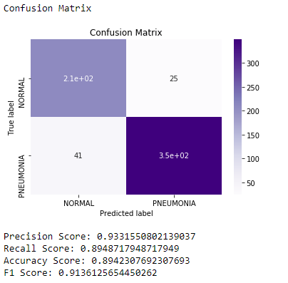
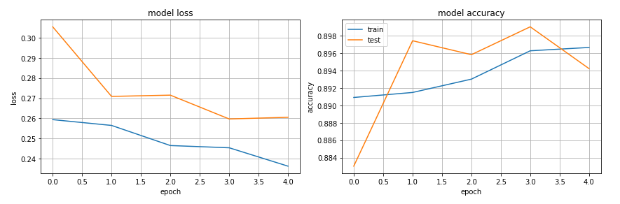
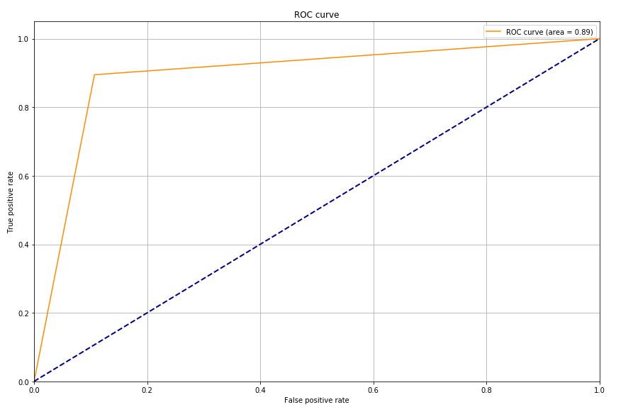

# Diagnosing Pneumonia Using AI

<a href="https://github.com/ariavathlete/dsc-mod-2-project-v2-1-onl01-dtsc-ft-041320/blob/master/Document14.pdf"> Blog </a>
<a href="https://github.com/ariavathlete/pneumonia_diagnosis/blob/master/Clinical%20Case%20of%20Pneumonia.pdf"> Presentation </a>
<a href="https://drive.google.com/file/d/132X3UY9H_6BgXfvcBY1MgIdgHzgqQWP-/view?usp=sharing"> Video Recording </a>

  

# Table Of Contents
* [Purpose](#purpose)
* [Data Description](#data-description)
* [Data Proportion](#data-proportion)
* [Data Augmentaion](#data-augmentation)
* [Modelling](#modelling)
* [Recommendation](#recommendation)
* [Future Work](#future-work)
  
<!---
# = h1
## = h2
### = h3
#### = h4
##### = h5
--->

# Purpose
The purpose of this research is to build a classifier that can correctly diagnose Pneumonia. Why Pneumonia?
   * 100,000 Deaths per year due to the misdiagnosis of pneumonia. Wrongful diagnosis of pneumonia can be very life threatening given that it leads to an increase in severity due to lack of treatment. Especially in cases where the patient might have a more serious infection like COVID-19.

   * Pneumonia is the reason for 1 out of  6 childhood death making it the leading cause of fatality in kids under 5 years. 

   * In the United States, the death rate of pneumonia is 10 out of every 100,000 individuals and this usually the rate in most developed countries. Meanwhile, in Africa, the death rate of pneumonia is 100 out of every 100,000 individuals and this is normal in most developing countries.

   

## Data Description
For this research, I used the Pneumonia dataset from Kaggle’s website. It consisted of about 5000 x-ray images of pediatric patient which were labeled by a specialist as either Normal or Pneumonia. 

## Data Proportion
  

## Data Augmentation
The data was heavy imbalanced so I'll use ImageDataGenerator to create additional dataset to help our modeling training. This will allow the network to see more diversification withing the dataset without any reduction in how representative the dataset for each category is during training. I won’t do the same for the test dataset as I won’t want to tamper with the data that I’ll be validating with. My parameters here are; a re-scale value of 1/255, a shear range of 0.2, a zoom range of 0.2, and I set the horizontal flip to True. 

After that, I inserted some images using flow from directly. My parameters are; 32 images should be used for training at a given instance (batch size), my image size is 224 X 224 and the class mode is set to categorical. 

I go on and apply the same parameters I used for my training dataset to my test dataset and then I call my fit generator.  

## [Modelling](./pneumonia_classifier.ipynb)
The network used is VGG16 because it’s known for having pretty high accuracies for image classification problems so I have no doubt it would work perfectly for my problem. 
After importing my VGG16 model and set the appropriate weights for the type of images in the dataset and set the Include Top parameter to false.
This will ensure that the last layer is drop and I did this because I don’t want to classify thousand different categories when my specific problem only has two categories. So, for this I skip the last layer. The first layer is also dropped since I can simply provide my own image size as I did.

## Interpretion
The accuracy is 91 % and this is the amount of time the predicted result is actually correct.

The recall percentage is 90% and this is the probability of the model diagnosing a correct positive diagnosis out of all the times it diagnosed positive. This would be the best metric in this case as we would rather give a wrong positive diagnosis than give a wrong negative diagnosis.
 
  

The model loss is 0.2 out and this is the amount the model penalizes for incorrect predictions ~ 10%

  

The AUC score is 0.89 and this is the average probability that the model can diagnose each X-ray image correctly.

  

### Recommendation
The recall score will be the main metric for this project since it’s the most important metric in medical problems given that - doctors will rather make a wrong positive diagnosis than make a wrong negative. 

Health professionals are welcomed to integrate this model, after thorough verification, into their medical software to help them correctly diagnose pneumonia.

# Future Work
   * Other Lung Diseases: Create a classifier to differentiate pneumonia x-rays from other lung infections like COVID-19,  Tuberculosis, etc.
 
   * Target Detection: Create a classifier to detect what section of the lungs the infection is located.

   * Model Improvement: Collect more data and tune more layers to the transfer learning model to improve its performance..
